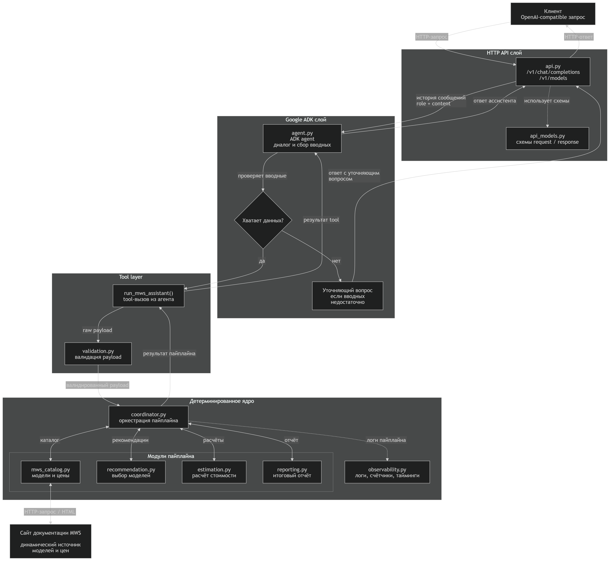

# MWS GPT Model Selection Assistant

Практическая работа для стажировки: ассистент, который помогает выбрать модель из **MWS GPT Model Hub** под конкретный сценарий, нагрузку и бюджет

Проект специально сделан не как один большой prompt, а как связка:

- **Google ADK** для диалога
- **детерминированного Python-ядра** для подбора и расчета стоимости
- **API в формате OpenAI** для внешнего доступа
- **динамической загрузки каталога и цен MWS**

## Что умеет

- загружает актуальные модели и цены с сайта MWS во время работы сервиса
- подбирает модели под `chat`, `coding`, `analysis`, `embedding`
- оценивает стоимость с учетом базовых и акционных цен`
- строит структурированный отчет из блоков:
  - `input_data`
  - `recommended_models`
  - `calculations`
  - `limitations`
- поддерживает обычный ответ и `stream=True`
- поддерживает продолжение диалога через `session_id` / `X-Session-Id`

## Архитектура

Основной поток запроса:

`Клиент -> API -> ADK agent -> run_mws_assistant() -> coordinator -> catalog / recommendation / estimation / reporting -> ответ`



Короткое описание слоев:

- `mws_assistant/api.py`  
  HTTP API в формате OpenAI
- `mws_adk_app/agent.py`  
  диалоговый слой на Google ADK
- `run_mws_assistant()`  
  единственная точка входа из агента в Python-ядро
- `mws_assistant/coordinator.py`  
  оркестрация всего пайплайна
- `mws_assistant/mws_catalog.py`  
  загрузка, парсинг и кэширование каталога MWS
- `mws_assistant/recommendation.py`  
  фильтрация и ранжирование моделей
- `mws_assistant/estimation.py`  
  расчет стоимости
- `mws_assistant/reporting.py`  
  сбор итогового отчета

Подробности:

[docs/architecture_overview.md](docs/architecture_overview.md)

## Соответствие ТЗ

| Требование | Статус | Комментарий |
| --- | --- | --- |
| API в формате OpenAI | Да | `GET /health`, `GET /v1/models`, `POST /v1/chat/completions` |
| Google ADK | Да | агент + tool boundary |
| Динамические данные MWS | Да | каталог и цены парсятся с сайта MWS |
| Подбор моделей | Да | вынесен в отдельный модуль |
| Расчет стоимости | Да | отдельный модуль с учетом `base/promo` |
| Структурированный отчет | Да | `input_data`, `recommended_models`, `calculations`, `limitations` |
| Диалог в рамках сессии | Да | через `SessionService` и `session_id` |
| Тесты | Да | API, валидация, подбор, расчет, кэш |
| `stream=True` | Да | потоковый ответ через SSE |

## Быстрый запуск

### 1. Создать окружение

```powershell
python -m venv .venv
.venv\Scripts\Activate.ps1
python -m pip install -r requirements.txt
```

### 2. Заполнить `.env`

Шаблон:

[.env_example](.env_example)

Минимально нужны:

```env
OPENAI_API_KEY=<API key сервисного аккаунта MWS>
OPENAI_API_BASE=https://<твой-endpoint>/v1
MODEL_NAME=qwen3-235b-instruct
PYTHONUTF8=1
```

### 3. Запустить API

```powershell
.venv\Scripts\python.exe -m mws_assistant.api
```

Адрес:

```text
http://127.0.0.1:8080
```

### 4. Запустить ADK UI

```powershell
adk web
```

Если запускать из корня репозитория, в списке приложений нужно выбрать **`mws_adk_app`**

### 5. Запуск в Docker

```powershell
docker compose up --build api
```

## API

Доступные endpoints:

- `GET /health`
- `GET /v1/models`
- `POST /v1/chat/completions`

Поддерживается:

- обычный ответ
- `stream=True`
- `user`
- `session_id`
- `X-Session-Id`

Пример запроса:

```powershell
$body = @{
  model = "mws-assistant"
  messages = @(
    @{
      role = "user"
      content = "Подбери недорогую модель для эмбеддингов"
    }
  )
  stream = $false
} | ConvertTo-Json -Depth 5

Invoke-RestMethod `
  -Uri "http://127.0.0.1:8080/v1/chat/completions" `
  -Method POST `
  -ContentType "application/json" `
  -Body $body
```

## Тесты

Запуск:

```powershell
.venv\Scripts\python.exe -m pytest -q
```

Что покрыто:

- валидация входных данных
- логика подбора моделей
- расчет стоимости
- API в формате OpenAI
- работа серверной сессии
- потоковый ответ `stream=True`
- кэш каталога MWS

## Материалы для проверки

Если смотреть проект как практическую работу, удобнее всего начать с этих файлов:

- [docs/reviewer_guide.md](docs/reviewer_guide.md)
- [docs/architecture_overview.md](docs/architecture_overview.md)
- [docs/reviewer_runs/qwen3-235b-instruct](docs/reviewer_runs/qwen3-235b-instruct)

Там лежат:

- краткий маршрут проверки
- описание архитектуры
- ручные прогоны с примерами диалога

## Ограничения

- серверная сессия хранится в памяти процесса и теряется после рестарта
- кэш каталога тоже хранится только в памяти процесса
- для обычного ответа возвращается статистика по токенам, для stream=True отдельного блока пока нетотдельного блока пока нет
- каталог MWS парсится по HTML, поэтому при изменении верстки парсер может потребовать доработки
- правило 24 часов моделируется на уровне дневной агрегации

## Что можно улучшить дальше

- сделать постоянное хранилище для сессий и кэша
- добавить информацию о количестве токенов и для `stream=True`
- добавить отдельные регрессионные тесты парсера
- еще сильнее ужесточить поведение агента на сложных follow-up сценариях
